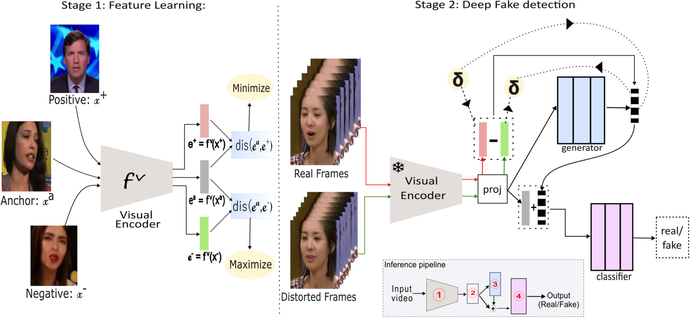

# 📦 Project Title

> One‑sentence elevator pitch that hooks readers.

<!-- Teaser Image -->

<p align="center">
  
</p>
<!-- Replace `docs/teaser.png` with the path to your image -->

---

## 🎬 Demo Video

<!-- GitHub renders HTML video tags. Alternatively link to YouTube. -->

<p align="center">
  <video src="assets/demo.mp4" controls width="600"></video>
</p>
<!-- Or, if you prefer YouTube: https://youtu.be/XXXXXXXX -->

---

## 🔗 Useful Links

* 🌐 **Live Site:** [https://example.com](https://example.com)
* 📖 **Documentation:** [https://example.com/docs](https://example.com/docs)
* 🐛 **Issue Tracker:** [https://github.com/username/project/issues](https://github.com/username/project/issues)

---

## 📑 Table of Contents

* [About](#about)
* [Features](#features)
* [Installation](#installation)
* [Usage](#usage)
* [Contributing](#contributing)
* [License](#license)

---

## 📝 About

Briefly describe what the project does, who it’s for, and why it matters.

## ✨ Features

* Feature 1 – *concise description*
* Feature 2 – *concise description*
* Feature 3 – *concise description*

## ⚙️ Installation

```bash
# Clone the repo
git clone https://github.com/username/project.git

# Navigate to the project directory
cd project

# Install dependencies
npm install  # or pip install -r requirements.txt, etc.
```

## 🚀 Usage

```bash
# Start the application
npm start  # or python main.py, docker compose up, etc.
```

## 🤝 Contributing

Pull requests are welcome! For major changes, please open an issue first to discuss what you would like to change.

## 📄 License

Distributed under the MIT License. See [`LICENSE`](LICENSE) for more information.

---

> *Crafted with care — replace any placeholder paths, text, or commands with details specific to your project before publishing.*
